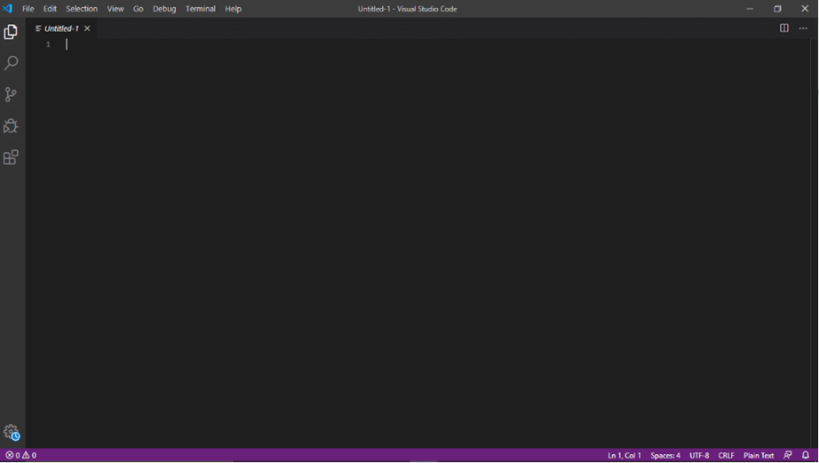

# RESEARCH AND ANALYSIS OF THE CODECEPTJS TESTING TOOL (JAVASCRIPT)
Final project for the Software Testing course (using CodeceptJS with Puppeteer for automated testing).

## TEAM MEMBERS
- Nguyễn Thái Minh Thiện - 2000004762 
- Nguyễn Hoàng Minh - 2000001452
- Lê Nguyễn Đình Hiếu - 2000004220 
- Lê Phùng Long Nhật - 2000002441 
- Phạm Trung Tín - 2000002491

## CURRENT SITUATION
Currently, the field of software testing plays a crucial role in the software development process. Companies are integrating testing procedures into their development workflows. This means that testers not only verify the software but also ensure that the product meets specific quality requirements and standards.

Nowadays, many companies focus on automated testing to enhance accuracy, improve reliability, and minimize human errors. Additionally, emerging technologies such as Machine Learning (ML) and Artificial Intelligence (AI) are being applied to improve software testing capabilities.

In modern methodologies like Agile, software testing is deeply integrated into the development process and must be conducted throughout the entire software development lifecycle (end-to-end testing).

Overall, the software testing industry is growing rapidly, playing a critical role in software development, and is considered essential for ensuring software quality.

To meet these demands, our team has researched and identified a tool that can effectively address these challenges—CodeceptJS. To gain a deeper understanding of what CodeceptJS is and why it can efficiently solve modern software testing problems, we will discuss it in detail in the following sections.

### Purpose and Scope of Testing
In this thesis, we focus on analyzing the key features of CodeceptJS, its strengths and weaknesses, and the solutions it provides.

## WHAT IS CODECEPTJS?
CodeceptJS is an automated end-to-end testing framework for web applications. End-to-end testing differs from Unit Testing (which only tests individual components) and Manual Testing (which tests the final product manually). While Manual Testing also verifies the final product, End-to-End Testing is automated.

CodeceptJS is designed to make writing and executing test cases simpler and more user-friendly. It supports various browsers and technologies such as WebDriver, Puppeteer, and Playwright (Helpers).

Additionally, CodeceptJS integrates with tools like Mocha, Chai, and Sinon, offering a comprehensive and flexible testing experience. It allows test cases to be written using easy-to-read and understandable syntax, supporting multiple programming languages such as JavaScript, TypeScript, and PHP.

Furthermore, CodeceptJS provides useful features like capturing screenshots and videos during testing, along with clear and detailed test reports for better analysis.

## ARCHITECTURE OF CODECEPTJS


## OBJECTIVES OF USING CODECEPTJS FOR THIS PROJECT
The objective of using CodeceptJS with the Puppeteer helper in this project is to implement three simple test cases: unsuccessful login, successful login, and logout (by querying elements using XPath). After that, we will integrate it with Testomat.io to manage the test cases for CodeceptJS.

## CODE USAGE GUIDE
### 1. Installation and Setup
A fundamental requirement for using CodeceptJS is having NodeJS installed, as CodeceptJS runs on the NodeJS platform.

Currently, there are many popular IDEs for JavaScript development, such as Visual Studio Code, Atom, IntelliJ IDEA, WebStorm, and Brackets. However, for this project, we will use Visual Studio Code.

Therefore, we need to download and install Visual Studio Code and the NodeJS library, as shown in the following images:


After downloading, this is the result:




First, we will create a new directory at a chosen location with a custom name. In this case, we will create a new folder named CodeCeptJS_DACK_Demo at the following path:
```
C:\Users\ntmth\Desktop\Kiểm thử phần mềm
```

To create this folder using the command line (CMD), we use the following command:
```
mkdir CodeCeptJS_DACK_Demo
```


After that, we will navigate to the newly created directory using the following command: 
```
cd CodeCeptJS_DACK_Demo
```


Next, we will open Visual Studio Code using the following command:
```
code .
```


To begin the CodeceptJS demo, we first initialize NPM by running the following command:
```
npm init -y
```


At this point, we will see the package.json file appear, as shown in the provided image.

Understanding package.json: Essentially, the package.json file is the core of the Node.js ecosystem and is fundamental for working with Node.js, npm, and JavaScript. It serves as a manifest for the application, listing dependencies, libraries, and other configurations used in our project.

To work effectively with Node.js and JavaScript, every developer in this ecosystem should be familiar with package.json. Since a basic understanding of this file is crucial for Node.js development, let's go through some of the most common and important properties you'll need to use.

Next, we will install the CodeceptJS and Puppeteer packages using the following command:
```
npm install codeceptjs puppeteer --save-dev
```

This command will:
<ul>
    <li>Install CodeceptJS (the testing framework).</li>
    <li>Install Puppeteer (a headless browser for automated testing).</li>
    <li>Save these dependencies under devDependencies in the package.json file.</li>    
</ul>


At this point, a new file named package-lock.json will appear at this <a href="https://duthanhduoc.com/blog/tai-sao-package-lock-json-ton-tai-va-cach-no-hoat-dong">web page</a> 

Next, we will initialize CodeceptJS using the following command:
```
npx codeceptjs init
```


After running the initialization command, a series of setup questions will appear. We will configure them as follows:


Next, we will create a test file. First, we will write a test for an unsuccessful login attempt.

To do this, navigate to the tests folder and create a new test file, for example:


And our interface will look like this:


Next, we will proceed with coding (here, we will demonstrate the pre-written code, so the file names, directory names, and paths may be different).


Here, we will explain some key methods used in CodeceptJS:
<ul>
    <li><b>Scenario():</b> Defines and executes a test case.</li>
    <li><b>I:</b> Represents an actor (a test abstraction for the tester). It also delegates actions to the active helper (e.g., Puppeteer).</li>
    <li><b>amOnPage("[url]"):</b> Navigates to the specified URL for testing.</li>
    <li><b>wait(seconds):</b> Pauses execution for a specified time (in seconds).</li>
    <li><b>fillField("Xpath Selector", "replaced text"):</b> Enters text into an input field (textbox).</li>
    <li><b>click("Xpath Selector"):</b> Clicks on a button or any clickable element.</li>
    <li><b>saveScreenshot("ImageName.extension"):</b> Captures a screenshot and saves the test result.</li>
    <li><b>tag("@string"):</b> Tags test files, allowing them to be executed on multiple browsers (Chrome, Firefox, etc.) simultaneously (Multiple Browsers Execution). More details can be found at http://xt1.org/codecept/multi/.</li>
    <li><b>see("string"):</b> Checks if a specific string appears on the screen. If found, it returns the string in the terminal output.</li>
</ul>

In addition, there are many other useful methods that you can explore further at <a href="https://codecept.io/helpers/Puppeteer/">here</a>

After completing the test demo, we will set up a reporter to store and generate test reports.


Here, we are only providing an overview of the demo process. For a more detailed understanding of the demo, we will present it live during the final presentation of the Software Testing course.

## CONCLUSION
In this project, we have provided an overview of the CodeceptJS framework and Puppeteer, along with the most common and essential functions. However, CodeceptJS offers many more powerful features.

For future developments, we plan to explore CodeceptJS in greater depth and create more real-world, complex testing scenarios to demonstrate its full potential.

## REFERENCES
[1] https://codecept.io/

[2] https://testomat.io/

[3] https://techmaster.vn/posts/36137/codeceptjs-phan-1-codeceptjs-la-gi-cai-dat-nhu-the-nao

[4] https://www.youtube.com/watch?v=rwfGf4cGUNc

[5] http://xt1.org/codecept/multi/

[6] https://codestus.com/posts/kien-thuc-co-ban-ve-file-packagejson

[7] https://duthanhduoc.com/blog/tai-sao-package-lock-json-ton-tai-va-cach-no-hoat-dong

[8] https://www.youtube.com/watch?v=BRMWstiOTks&t=708s